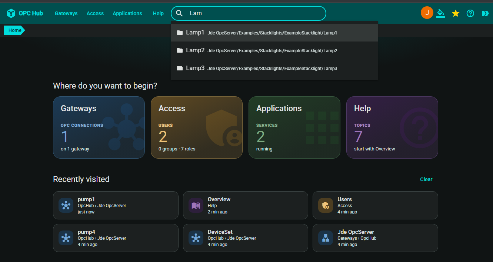

# opc-hub

[](https://github.com/Jde-cpp/opc-hub/actions/workflows/linux-ci.yml?query=branch%3Amain)
[](https://github.com/Jde-cpp/opc-hub/actions/workflows/win11-ci.yml?query=branch%3Amain)
[](https://github.com/Jde-cpp/opc-hub/actions/workflows/win2025-deps.yml?query=branch%3Amain)
[](https://github.com/Jde-cpp/opc-hub/actions/workflows/win2025-build.yml?query=branch%3Amain)
[](https://github.com/Jde-cpp/opc-hub/actions/workflows/linux-release.yml)

OPC Hub is an Angular web front end over OPC UA servers, with a C++ back end.

It browses a server's address space and reads, writes and subscribes to its nodes.  Users, groups, roles and resources
say who may reach what.  The site talks to the back end over GraphQL and a protobuf websocket.  The database is SQLite by
default, with MySQL and SQL Server also supported.

An OPC UA server of our own, `Jde.Opc.Server` on [open62541](https://www.open62541.org/), ships beside it as a first
connection.



## Install

Each [release](https://github.com/Jde-cpp/opc-hub/releases) carries three assets: `OpcHubSetup-<version>.exe` (Windows -
services for all users, or a per-user install without administrator rights), `jde-opchub_<version>_amd64.deb` (Ubuntu
24.04 or later, systemd units) and `jde-opchub-<version>-linux-amd64.tar.gz` (Linux without root, `systemctl --user`
units).  The installers use SQLite, created on the first start; there is no server to set up.

1. Install it: run `OpcHubSetup-<version>.exe`, or `sudo apt install ./jde-opchub_<version>_amd64.deb`.
2. Browse to http://localhost:1967/ (from another machine, `http://<hub>:1967/`, for an all-users or root install).
3. Log in.  With the **OPC UA Server** component the login is Google, and the bundled server is already a connection.
   Without it, add your own server under Applications > OpcHub > Connections while still signed out, have the two sides
   trust each other's certificates, then sign in as `<slug>\<user>` with that user's password on the server.  The site's
   *Overview* help walks it as *First steps*.

The full walk - install modes, firewall and ports, IIS or nginx in front, what each installer lays down and what an
uninstall leaves behind - is [`apps/OpcHub/README.md`](apps/OpcHub/README.md) (Install), then
[`apps/OpcHub/setup/README.md`](apps/OpcHub/setup/README.md) for Windows and
[`apps/OpcHub/setup/linux/README.md`](apps/OpcHub/setup/linux/README.md) for the `.deb` and the tarball.

## What is here

| | |
|---|---|
| [`apps/OpcHub`](apps/OpcHub) | the product: the AppServer and the OpcGateway linked into one exe, its installers under `setup/` |
| [`apps/OpcGateway`](apps/OpcGateway) | the gateway role: OPC UA client sessions, browse/read/write/subscribe, the server connections and the OPC login |
| [`apps/AppServer`](apps/AppServer) | the application server: sessions, the app registry, log collection |
| [`apps/OpcServer`](apps/OpcServer) | our OPC UA server: the DI/IA nodesets plus a pumps demo address space; under `emulator/`, a PLC stand-in that feeds it moving values |
| [`libs`](libs) | `fwk` (coroutines, io, settings, logging, crypto), `db` (schema and query layer; sqlite, mysql and odbc drivers), `ql` (GraphQL over `db`), `access` (users, groups, roles, resources), `web` (HTTP and websocket client and server), `app` (the app protocol between services), `opc` (the open62541 client wrappers) |
| [`include/jde`](include/jde) | the libraries' public headers |
| [`web`](web) | the Angular site: four libraries, `spa` → `framework` → `access` → `opc`, the generated `proto` package, and the application under `web/opc/site` |
| [`build`](build) | the third-party superbuild (`build/CMakeLists.txt`), the cmake helpers and the shell build functions |
| [`extensions/jde`](extensions/jde) | a VS Code extension with the build-directory commands the workspaces use |
| [`.github`](.github) | the workflows and the self-hosted Linux runner's image |

The gateway and the AppServer still build standalone, for split deployments of N gateways per AppServer.

## Building

The build is C++26 and CMake 4.2.3 or later.  On Linux (Ubuntu 24.04 or later) the compiler is clang 23 with libc++.
On Windows it is LLVM's clang with the VS 2026 toolset's runtime, and openssl and sqlite3 come from vcpkg
([`vcpkg.json`](vcpkg.json)).

Every configure is a preset in [`CMakePresets.json`](CMakePresets.json), OS-split into `CMakePresets.Linux.json` and
`CMakePresets.Windows.json`.  The `-repos` presets build the third-party tree and the `-jde` presets build this repo.

The presets read four environment variables: `REPO_DIR` (the dependency root - **not** this checkout; the deps install
under `$REPO_DIR/install/$CXX/<Debug|RelWithDebInfo>`), `JDE_DIR` (this checkout), and `JDE_BUILD_DIR` + `JDE_COMPILER`,
under which a build lands at `$JDE_BUILD_DIR/$JDE_COMPILER/<checkout>/<debug|release>`.

```bash
# the third-party tree, once - fmt, spdlog, gtest, absl, protobuf, jsonnet, ryml, open62541 + its nodeset loader;
# the build dir is your choice, the install lands under $REPO_DIR/install
cmake -B $REPO_DIR/build/debug -S . --preset linux-clang-debug-repos && cmake --build $REPO_DIR/build/debug -j 8
# Boost and the sqlite amalgamation are built by build/libarary_commands.sh

# the repo - `-B` is required: the Linux presets set no binaryDir
B=$JDE_BUILD_DIR/$JDE_COMPILER/opc-hub/debug
cmake -B $B -S . --preset linux-clang-debug-jde
cmake --build $B -j 8
cd $B && ctest --timeout 300 --output-on-failure   # the db-backed suites run on in-memory sqlite - no server needed
```

The release build is `linux-clang-relWithDebInfo-jde` (`win-clang-release-jde` on Windows), which is what the installers
pack.  `build/buildFunctions.sh` wraps the same commands as `reconfig`, `build` and `compile` for the VS Code tasks.

To run the hub from the build tree, from `<buildDir>/runtime`:

```bash
Jde.Opc.Hub -c -tests -settings=$JDE_DIR/apps/OpcHub/config/Opc.Hub.jsonnet -include=args/sqlite -arg path=<file>
```

### The site

`web/opc/my-workspace` is generated, not tracked: [`web/opc/scripts/setup.sh`](web/opc/scripts/setup.sh) scaffolds it
with `ng new`, links the four libraries and the site in, and runs `ng build`.  Then, from the workspace, `ng serve`
(http://localhost:4200, against a hub on 1967) and `ng test` (Vitest).

## CI and releases

| workflow | when | what |
|---|---|---|
| Linux | every push to `main`, or by hand on any branch | the self-hosted containerised runner ([`.github/docker`](.github/docker)): a Debug build and ctest |
| Win11 | by hand | the self-hosted Windows workstation: a Debug build and ctest |
| Win2025 Deps | by hand on `main`, before the first Win2025 run and after any dependency or preset bump | the hosted windows-2025 image: builds the third-party tree and caches it |
| Win2025 | a `20*` tag push, or by hand | the site, then the release build against the cached deps and the installer; fails if the cache is missing |
| Linux Release | a `20*` tag push, or by hand | the site on a hosted runner, then the release build, the `.deb` and the tarball on the self-hosted one |

A push of a `yyyy.MM.dd` tag runs Win2025 and Linux Release, which publish all three assets on that tag's GitHub release.
The version is `JDE_VERSION` in [`CMakePresets.common.json`](CMakePresets.common.json).

## License

MIT - [`LICENSE`](LICENSE).  The notices of the third-party code inside the shipped binaries are in
[`THIRD-PARTY-NOTICES.txt`](THIRD-PARTY-NOTICES.txt), generated by `build/third-party-notices.sh`; the installers and
the site's About page carry it.
