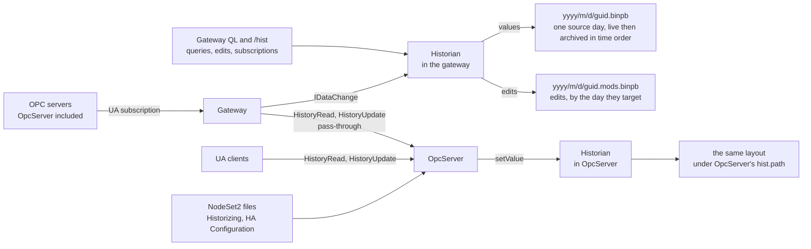

# Historian spec

2026-09-25, last edited 2026-10-07

## Overview

The historian records OPC node values over time and serves them back with the semantics of the OPC UA Historical Access services: through those services on OpcServer, and through QL and `/hist` on the gateway, so clients can read, aggregate, correct and audit past data instead of only the live value.

It is a library that links into the gateway, standalone or inside the OPC Hub process, and into OpcServer, which keeps the history of the nodes its nodesets mark as historizing. A change that stays inside a node's deviation band is not stored. The rest are written as protobuf per node group and archived on the same daily pattern as the logs.

The behaviour follows [OPC 10000-11, Historical Access](https://reference.opcfoundation.org/specs/OPC-10000-11/4). Everything below comes from the original notes plus how the existing log archive and gateway already work.

## Requirements

The historian must cover the Part 11 read and update services for data values, and store everything the notes ask for. Events and annotations are out of scope for the first cut.

| Area | Requirement | From |
| --- | --- | --- |
| Collect | Store a change only when it passes the node's compression test: it leaves the deviation band around the last stored value, or the status code changed. A change held back by `MinTimeInterval` is kept and stored when the interval expires, and a per-group timer re-stores a node's last value when the node's `MaxTimeInterval` passes without one, stamped in the source's clock so it never sorts after a newer change. Every stored record carries source and server timestamps and the status code. The first value after a connection break is judged by Part 11 §4.3's comparison instead, against the last value delivered rather than the last stored, which stores nothing, a `Bad_DataLost` record no later than the value and then the value, or, for a value earlier than the last delivered, the record alone. | notes, Part 11 §4, decisions 2026-09-27, 2026-09-28, 2026-09-29 and 2026-10-05 |
| Thresholds | `ExceptionDeviation`, `ExceptionDeviationFormat`, `MinTimeInterval`, `MaxTimeInterval` and `Stepped` are set per node, since a deviation band only means something against that node's own range and OpcServer's nodesets set a heartbeat per node. The group also has a `MaxTimeInterval`, the default for its nodes that set none. Together they are the node's `HistoricalDataConfiguration`. A node with no `ExceptionDeviation` stores every change, and an enumeration's node has none. `Stepped` defaults to true, so a stored value holds until the next record. `MaxTimeInterval` 0 turns the heartbeat off. | notes, Part 11 §5.2.2, decisions 2026-09-29 and 2026-10-05 |
| Read | Serve HistoryRead for `ReadRawModifiedDetails`, `ReadAtTimeDetails` and `ReadProcessedDetails` (aggregates) over a time range, with continuation points and `MaxReturnDataValues`. | Part 11 §6.5 |
| Edit | Serve HistoryUpdate with `UpdateDataDetails` for INSERT, REPLACE and UPDATE, plus `DeleteRawModifiedDetails` and `DeleteAtTimeDetails`. REMOVE belongs to annotations, which are out of scope, and deleting modified values is refused. | notes, Part 11 §6.9, decision 2026-09-27 |
| Audit | Keep the original value of every edited or deleted record as modified data, with `ModificationInfo` (`modificationTime`, `updateType`, `userName`). | notes, Part 11 §4.4 |
| Identity | A record the historian writes itself carries no identity. A record written by a user, and every modification, carries the writer's `identity_id` and the writer's name as it was then, which `userName` returns, so renaming an identity never rewrites who made a past edit. | notes, decision 2026-09-29 |
| Access | Who may read or change history is decided per request, never by the collector's rights: on the gateway, Read on the group for queries and `/hist` subscriptions, Update for edits and Delete for deletes; on OpcServer, the same rights on each node, as the node-access page grants them. | decision 2026-09-27 |
| Grouping | Values are stored per node group. Nodes can join or leave a group while the service runs, with no restart and no rewrite of existing data. | notes |
| Templates | A template names a node set by browse path relative to a root, with namespaces as URIs, and each member's thresholds, which a group's nodes inherit unless they set their own. Applying it to one asset's root on one server creates one group, so Pump1 to Pump4 are four groups from one template. A group belongs to one OPC server: `server_connection_id` and the root are properties of the group, and a node belongs to at most one group per server. | decision 2026-09-26, decision 2026-09-28 |
| Storage | Protobuf records on disk, buffered in memory like the log: a group's records are sorted by source time and written, and fsynced, when its buffer reaches 8 KB or `delay` elapses, one minute by default. All groups' buffers together are capped at `maxBuffer`, 64 MiB by default. | notes, decisions 2026-09-28 and 2026-09-29 |
| Archive | Each day's file is written in place under `<yyyy>/<m>/<d>`, mirroring the log archive. A record goes in the file of its SourceTimestamp's day in `timeZone`, UTC by default, the time Part 11 selects values by. Today's file is the live file, append-only; after midnight it is rewritten sorted by source time as the day's archive, and a late record for an archived day is merged into place, so an archive is always in time order. | notes, Part 11 §4.5, decisions 2026-09-27 and 2026-09-28 |
| Retention | Archives are kept as long as they exist on the file system. The historian never purges; file-system permissions decide who may remove a file. | decision 2026-09-26 |
| Query | Reads are sequential scans of the day files a range touches. There is no index in the first cut; the layout leaves room for a sidecar index if measurements ever call for one. A QL read returns at most `readLimit` values a call, set in the `hist` configuration, and a continuation for the rest. | notes, decision 2026-09-28 |
| Publish | On OpcServer, expose `Historizing` and `HistoricalDataConfiguration` per node, and `HistoryServerCapabilities` for the service, with only the capabilities above set true. | Part 11 §5.2.2, §5.7.2 |
| UA | OpcServer keeps the history of the nodes its nodesets mark `Historizing`: it links the historian library, collects through open62541's `setValue`, writes its own files, and answers HistoryRead and HistoryUpdate in-process, each node configured by its nodeset's HA Configuration. The gateway's groups are separate and may include OpcServer's nodes, which are then stored by both. DeleteAtTime is QL-only, on the gateway: open62541 1.5.9 has no plugin callback for it. | decision 2026-09-25, decisions 2026-09-27 and 2026-09-28 |
| Pass-through | On the gateway, read and edit the history a server keeps itself, through the same QL fields as a group's, over the caller's own UA session, so the server's access rules decide and the gateway stores nothing. | decision 2026-10-07 |
| Wire | No process writes another's files: each historian writes its own `hist.path` through the library, holding an exclusive lock on it, and nothing else opens them. UA clients call the standard HistoryRead and HistoryUpdate services on OpcServer's opc.tcp endpoint, which open62541 routes to the history backend. | decision 2026-09-25, decisions 2026-09-27 and 2026-09-28 |
| Subscribe | A client such as the web app subscribes to a group's nodes over `/hist` with a `fromTime`. The first messages carry the history from `fromTime` to now, paged at `readLimit` values each, and every stored value after that streams as it is recorded. | decision 2026-09-25 |
| Deploy | Runs inside the gateway, standalone or in the OPC Hub process, and inside OpcServer for its own nodes. Both ship in the first cut; there is no standalone historian exe. | notes, decision 2026-09-28 |

## Design

The historian is a new library, `libs/historian`, linked into the gateway and into OpcServer. Each host keeps a protobuf stream per group and day under its own `hist.path`, append-only while the day is live and in time order once it is archived, and answers Part 11 reads by merging raw records with later modification records.

Values and edits both pass through the historian that keeps the group. Each value goes to the file of its source day, appended to today's live file or merged in time order into a past day's archive, while edits go to an append-only file beside the day they target, which a read of that day merges in.

**Placement.** `Jde.Opc.HistorianLib` links into `Jde.Opc.GatewayLib` and `Jde.Opc.ServerLib`. In the gateway, its tables join the gateway's schema, its queries a QL hook beside `OpcQLHook`, and `/hist` sits beside `/opc` wherever the gateway's socket is served, on the gateway's own listener or the hub's. Its settings live in a `hist` block of [`Opc.Gateway.jsonnet`](../../../apps/OpcGateway/config/Opc.Gateway.jsonnet), which [`Opc.Hub.jsonnet`](../../../apps/OpcHub/config/Opc.Hub.jsonnet) takes as it takes the gateway's other blocks, with the same `path`, `delay`, `maxBuffer` and `timeZone` keys as `logging.proto`, plus `readLimit`, the most values one read returns (*Reads*), and the per-connection credential the collector logs in with (*Collector contract*). `path` defaults to `hist/opc-gateway` under the host's `logsDir`, and OpcServer's to `hist/opc-server`, so a hub and an OpcServer on one machine never contend for one lock (*Day files*). OpcServer's block is `/opcServer/hist`, beside its other settings, so a process that hosts both, as the tests' do, gives each its own. A host whose config has no `hist` block runs without its historian, as `logging.proto` leaves the log archive off, and as a host does whose lock another process holds (*Day files*). `timeZone` defaults to UTC, not the log's machine zone. The log's day directories only group its files, but the historian's decide which file a read opens, so a zone that changed under existing files, such as a container on UTC, a moved VM or an admin's setting, would hide every record near midnight in the neighbouring day's file. An IANA name pins another zone, which must not change once `hist.path` holds files. OpcServer's host is described under *OpcServer*, below.

**Hosts.** The historian runs in two places in the first cut, each with its own `hist.path` and lock (*Day files*), and there is no standalone historian exe. The gateway, standalone or inside the hub, historizes the groups defined on it, for any server it connects to, OpcServer included: it collects through its own subscriptions, stores, answers QL and `/hist`, and holds the templates. OpcServer historizes the nodes its own nodesets mark `Historizing` and serves them to UA clients through open62541 (*OpcServer*). The two are independent: an OpcServer node that is also in a gateway group is stored by both, each under its own path, which the first cut accepts. Apart from its groups, the gateway reads and edits the history a server keeps itself, OpcServer's or any other Part 11 server's, for the caller (*Pass-through*), which stores nothing on the gateway. When a node joins a group and its server marks it `Historizing`, the gateway logs a warning and keeps it, since both will then store it.

**Collection.** In the gateway, the historian implements `IDataChange::SendDataChange` beside `GatewaySocketSession`, so every monitored value reaches it as the full `UA_DataValue`, with source and server timestamps, which its items ask for (*Collector contract*, below). The gateway isn't told today that a connection broke, which the gap rule below needs, so `IDataChange` gets a connection-state callback carrying the time the connection broke, and one for its return, called before the new subscription delivers a value, since what arrives between the two was in flight (*Gaps*). When the historian joins a node the gateway already monitors, the gateway adds it to the existing item and no initial value arrives, so the historian reads the node explicitly after joining, as the `/opc` session does, and that read is the first value the gap rule compares. Groups are a new table pair, `hist_groups` and `hist_group_nodes`, edited through QL mutations and listed in `access_resources` so the Enforced switch applies, as is the templates' pair (*Templates*), whose edits change every group made from them. Both declare their key `autoincrement`, a new column flag the sqlite syntax writes as `PRIMARY KEY( id AUTOINCREMENT )` and the other dialects ignore, so an id is never issued twice, even after the newest row is purged, and a node's node\_index stays its own. `hist_groups` also carries a `guid`, unique and generated when the group is created, which names the group's files, so a group created after the database is restored or recreated never writes into an older group's files. The integer `id` stays the key that QL, access and the web use. A group can name any server the gateway connects to, OpcServer included (*Hosts*). A membership change updates the monitored items and appends a `NodeAdded` or `NodeRemoved` record to the group stream, so nothing already written is touched. `hist_group_nodes` has no `deleted` column, so a node leaves its group by purge, which frees the unique index (*Templates*) for another group. Rejoining adds a new row, and so a new node\_index, and a reader joins a NodeId's indexes, since each file maps its own (*Record format*).

**Collector contract.** Collection needs more of the gateway than a browser does, so the gateway's collector gets its own clients. It connects to each server under its own OPC credential, named per connection in the `hist` block: certificate authentication with the process's own certificate by default, or a user name and password for a server that takes no certificate token. Its clients are keyed apart from every web session's, even when a browser presents the same credential, so its subscriptions, monitored items and their parameters are never shared with a screen. Its items ask for `timestampsToReturn` `BOTH`, sample at the node's `MinTimeInterval`, or at 0, the server's fastest, when the node has none, and queue one publishing interval's samples: the publishing interval over the sampling interval, rounded up, plus one, or the deepest queue the server grants when sampling at 0. The subscription keeps the default 500 ms publishing interval. `CreateMonitoredItemsRequest` takes these as parameters instead of hard-coding them. A threshold edit that changes a node's `MinTimeInterval`, on its row or its template member, changes its item's sampling interval and queue size in place through ModifyMonitoredItems, which the gateway gains, having none today, so sampling never stops for a delete and create. The explicit read after joining an existing item, above, asks for both timestamps too. `SendDataChange` runs on the connection's strand under the monitoring lock, so the historian's only enqueues and returns, and never waits on the write lock a `/hist` snapshot takes.

**Templates.** `hist_templates` holds a named node set and `hist_template_nodes` holds each member as a browse path relative to a root, with that member's `ExceptionDeviation`, `ExceptionDeviationFormat`, `MinTimeInterval`, `MaxTimeInterval` and `Stepped`. A path is a list of browse names, each a namespace URI and a name, never a namespace index, so one template applies across servers whose namespace tables differ. A group is the template applied to one root on one server: `hist_groups` carries `template_id`, `server_connection_id` and the root NodeId, so Pump1 to Pump4 are four groups from one template, each on whichever server hosts it. Creating the group resolves every path from the root through the gateway's [`BrowsePathsToNodeIdResponse`](../../../apps/OpcGateway/src/uatypes/uaTypes.h), its wrapper around `TranslateBrowsePathsToNodeIds`, which gains a start NodeId, since it always starts at the Objects folder today, and follows `HierarchicalReferences` with subtypes instead of `Organizes` alone, so paths through `HasComponent` and `HasProperty`, the way asset models and companion specifications build Pump1/Motor/Speed, resolve; each browse name's URI becomes the server's index through its `NamespaceArray`. The resolved nodes go to `hist_group_nodes`, each row keeping its `template_node_id`. Its threshold columns are nullable, and null inherits the template member's value, so a template edit reaches every group at once and a per-node override is a row with its own value. Adding a member to a template resolves it in each of the template's groups, and removing one removes its node from each. A path that does not resolve is logged and left out, and `histResolve(group)` retries a group's unresolved members. Every NodeId the historian stores, the root, `hist_group_nodes` and `NodeAdded`, is an `ExpandedNodeId` carrying its namespace URI, which [`Opc.Common.proto`](../../../libs/opc/src/proto/Opc.Common.proto) already defines, so a server that renumbers its namespaces does not re-point history; each process converts at its UA edge. A node belongs to at most one group per server: `hist_group_nodes` carries its group's `server_connection_id`, and a unique index on that and the node refuses a second group, so a node's thresholds have one answer. A group with no template is an ad hoc node list on one server, as before. A group never spans servers: `server_connection_id` is a property of the group. It is the connection's key, declared with `pkTable` as the access tables declare `identity_id`, so it is a foreign key, and the database refuses to delete a connection that still has groups.

**Compression.** Every change passes the node's compression test before anything is written. The historian keeps the last stored value per node, and beside it the last delivered one, which the gap comparison needs (*Gaps*), and drops a change that stays inside the deviation band, `ExceptionDeviation` in `ExceptionDeviationFormat` units, unless the status code changed. A change of exactly the deviation has left the band, so a deviation of 0 stores every change, a repeated value included. `MinTimeInterval` rate-limits what remains without losing where the value settles: a change that passes within `MinTimeInterval` of the last stored value is held as the node's pending value. The interval is measured between their source times, so the samples one publish delivers together are as far apart as the source says. Each later change replaces the pending value, whether or not it passes, so a spike that falls back inside the band is not stored as where the value settled, and when the interval expires the pending value is stored with its own timestamps if it still passes the test. A later change sourced past the interval settles the pending value first, as at the interval's expiry, and is then judged against what that stored. A change of the node's `MinTimeInterval` moves that expiry with it: the pending value is stored at once, if it still passes, when the new interval has already ended, and otherwise once what is left of it has. A break settles it at once, stored if it passes the test as at the interval's expiry, since it was delivered before the break and the first value after the break goes to the gap comparison instead of replacing it. `MaxTimeInterval` is the heartbeat: one timer per group checks each node's deadline and re-stores the last value of each node that has stored nothing for its own `MaxTimeInterval`, flagged as a heartbeat in the record, which also carries the SourceTimestamp of the value it repeats, so a reader can tell it from a delivered change and a restart can still tell when that value was delivered (*Gaps*). For a value that came with no SourceTimestamp it carries the value's server\_ts, and says so. Its server\_ts is the timer's time, but its SourceTimestamp is that time carried into the source's clock: real values carry the source's time and arrive up to a publishing interval after it, so a heartbeat on the historian's clock could sort after a change sampled just before it and replay the old value over the new one, and more often when the source's clock runs slow. So a heartbeat's SourceTimestamp is the timer's time less the node's offset, which is the arrival time less the SourceTimestamp of the last change the node delivered, and never earlier than `MaxTimeInterval` after the node's last stored record. A first value after a break or a join doesn't set the offset, since its SourceTimestamp is when the value last changed, not when it was sent, and until a node delivers a change after a start its offset is 0. A change that passes the test with a SourceTimestamp at or before a heartbeat of its node still in the buffer drops that heartbeat, whether the change is stored or held pending, as does a first value after a break that is stored (*Gaps*), and a flush leaves any heartbeat made less than one publishing interval ago for the next flush, so the check still finds it; OpcServer, which receives values as they are written, holds none back. A heartbeat that a full buffer dropped and holds to write back (*Files and archive*) is dropped the same way, and the gap it would have ended then ends at the change. A heartbeat only repeats the last stored value, so it never counts as one for `MinTimeInterval`. The timer writes only while the node's connection is up, so a dead feed stays distinguishable from a flat line: during a break it writes nothing, and the break's `Bad_DataLost` (*Gaps*) marks it. A host can report a break late, and by then the timer has written through it, so the report drops each heartbeat of the node still in the buffer whose server\_ts is at or after the break time. One a flush already wrote stays, and the break's record goes after it (*Gaps*). Nor does it write for a node that holds a pending value, whose first value after a break is still to be compared, or whose last record is a marker: the first two are waiting to say what follows the last value, and a marker has no value to repeat. The deviation formats need a scale. ABSOLUTE\_VALUE is in the value's units. PERCENT\_OF\_VALUE is a percentage of the last stored value's magnitude, so at zero every change is stored. PERCENT\_OF\_RANGE and PERCENT\_OF\_EU\_RANGE are a percentage of the node's `InstrumentRange` or `EURange`, read from the server when the node is added or re-resolved and kept in `hist_group_nodes` as `range_low` and `range_high`; a node without the range its format needs stores every change, with a warning when it is added. The band applies to numeric scalars only: a Boolean, enum or string node ignores it and stores every change, since a state change is never noise and a stop detector depends on each one, and so does an array or a structure, which has no one value to hold a band around. An enumeration's values arrive as Int32, which the library cannot tell from a quantity, so its host resolves no `ExceptionDeviation` for a node whose DataType is one. `ExceptionDeviation`, `ExceptionDeviationFormat`, `MinTimeInterval`, `MaxTimeInterval` and `Stepped` are nullable columns on `hist_group_nodes`, null inheriting the template member's value (*Templates*); with neither set, a node stores every change, with no `MinTimeInterval` and `Stepped` true. A `MaxTimeInterval` that both leave null takes the group's, a column on `hist_groups` that defaults to 0, off. In OpcServer the same settings come from each node's HA Configuration instead (*OpcServer*).

**Gaps.** Reads carry a stored value forward until the next record, per `Stepped`, so the historian marks the gaps it must not bridge, by the comparison Part 11 §4.3 prescribes. A break is when the subscription drops, or when the service stops or crashes; for a stop or a crash the break is the group's last flush time, which start-up reads from its `.flushed` file (*Day files*), so a crash loses at most `delay` of buffered values, one minute by default, and so does a power loss, since every flush is fsynced (*Record format*). A break still open when the historian crashes is lost with it, so the restart's break can be later than the real one, and the stretch between carries the last value; that is accepted. The historian keeps the break time per node and writes no marker at the break; a pending value is settled then (*Compression*). A value that arrives while the connection is still down was in flight when it broke: it was sent before the break, so it is no first value after it. It takes the compression test like any other, and the break stands for the first value after the host reports the connection back; if `MinTimeInterval` is still holding it then, that value settles it first. The exception is a node with an earlier break that no value has answered yet, as when a connection breaks again before the node delivers: the value in flight is its first since that break, so it is judged against it, and the connection's break then stands in its place. When the node's first value after it arrives, its SourceTimestamp is compared with the last delivered value's: the newest value the server sent for the node, whether the compression test stored it, held it pending or dropped it, and never a heartbeat. §4.3 says the last stored value, but it assumes a historian that stores every change; here compression, `MinTimeInterval` and the heartbeat all make the last stored value differ from the last delivered one, and comparing with it would mark a gap after nearly every reconnect. An equal SourceTimestamp means no data was lost, and nothing is stored, when the value agrees: it has the last stored value's status code and, on the wire, its value, or it differs by no more than the compression test would drop. The last delivered value is either that stored one or a change the test dropped, so the stored one is enough to compare with, and after a stop it is the newest record's, read back. A source whose timestamps are coarse can change a value inside one, so an equal SourceTimestamp with a value that doesn't agree is treated as a later one. A node whose last record is a marker has no value to compare, and there the timestamp alone decides. A later one means the historian cannot know what it missed, so it writes a `Bad_DataLost` record, then stores the value. The record goes at the break time, or at the value's SourceTimestamp when that is earlier, as when the value changed just before the break and its notification was lost with the connection, so the node never reads Bad after the value that ends the gap; at an equal SourceTimestamp the record is written first, and every sort by source time is stable, so it stays first. The break time is in the historian's clock and a node's records are in the source's, so the record is never placed before the node's newest stored record, a heartbeat included, but for one the break's report or the value itself drops (*Compression*): when the source's clock runs ahead of the historian's it goes at that record's time, where the same stable sort keeps it after, rather than leave that record's value reading Good through the gap. The value's SourceTimestamp still caps it. An earlier one means the source's clock or state went backwards: the historian writes a `Bad_DataLost` record at the break time, or at the node's newest stored record when that is later, and logs a warning naming the node and both timestamps, but does not store the value, which at its own time would land before a record reads have already returned, so the node reads Bad until its next change. The last delivered value lives in memory, so after a stop or a crash the comparison takes the node's newest record on disk instead: a value by its own SourceTimestamp, and a heartbeat by that of the value it repeats (*Compression*); a value the band dropped before the stop then compares as later, and the rule above keeps the marker before it. A node the files hold no record of had no value to lose, so the stop is no break for it, and its first value is simply stored. The comparison means nothing when the last delivered value had no SourceTimestamp and was filed by its server\_ts, or when, after a restart, the node's newest record is a marker; then the first value is treated as later. A heartbeat's record says when the value it repeats had none, so a restart finds that as it finds the value's own record. Reads return that status for the gap, as §4.3 requires. Records dropped from a full buffer are a gap too, marked at the first dropped record and ended by the newest, which is written back (*Files and archive*). A marker goes in the file of its own time's day, so an outage that spans midnight is marked on the day it began. A node that leaves the group gets no marker: a read carries nothing past its `NodeRemoved`, and a rejoin is a break at the removal time. Until a connection returns, nothing on disk marks the outage, and a read carries the last value forward; that is intended, since the historian only learns whether anything was lost from the first value after the break. `MaxTimeInterval`'s heartbeat (*Compression*) is what keeps a flat line distinguishable from a dead feed, since it writes only while the connection is up.

**Record format.** Records are appended in protobuf's standard delimited form, a varint length then the body, one `HistoryRecord` oneof per record, so `parseDelimitedFrom` in any language reads the files. The log's [`Protobuf::SizePrefixed`](../../../include/jde/fwk/io/protobuf.h) is not reused: its 4-byte prefix is home-grown, it allocates and copies once per record, and its reader loads the whole file. The historian serializes straight into the write buffer and reads through a `CodedInputStream` that starts at a byte offset and stops at a limit, which a later index would need; since times are deltas, such an index keeps the absolute time beside each offset. Times are UA ticks, 100 ns since 1601, stored as `sint64` deltas instead of `google.protobuf.Timestamp` pairs, which dominated a record's size. Every file opens with a `FileStart` record holding the start of its day in absolute ticks. Each record's primary time, a `DataValue`'s source\_ts, a `NodeAdded` or `NodeRemoved` ts, a `Modification`'s target\_source\_ts, is a delta from the previous record's, and its other times, such as server\_ts or a start value's timestamps, are deltas from its own primary time. A `DataValue` whose server sent no SourceTimestamp leaves source\_ts unset and takes server\_ts as its primary time, the time it is filed and read by (*Files and archive*). A late record's delta is simply negative. Every append to a live file or a modifications file ends with a `Checkpoint` record holding the CRC-32C of the bytes since the file's previous one, computed by `IO::Crc::Calc32c` in [`crc.h`](../../../include/jde/fwk/io/crc.h): a table when evaluated at compile time, and at run time abseil's [`absl::ComputeCrc32c`](https://github.com/abseil/abseil-cpp/blob/20260526.0/absl/crc/crc32c.h#L113), which uses the CPU's CRC instruction (the presets' `cpuFlags` turn on the SSE4.2 and PCLMULQDQ it needs), and a flush then fsyncs each file it wrote, `fdatasync` on Linux and `FlushFileBuffers` on Windows. The first time the process opens a live file or a modifications file, to read it or to append, it scans it from the start and keeps it through the last checkpoint whose CRC matches. The scan never changes the file: a read serves only what the scan kept, and the first append truncates the file there, so a torn flush is dropped whole instead of corrupting every record after it. A torn flush is only ever a file's last append, since a flush fsyncs each file before the next one, so the truncation leaves alone, with an error, a file in which an append a historian sealed follows where the scan stopped: that is damage, not a torn flush, and truncating would delete the appends after it. The scan finds such an append by its checkpoint's bytes and the CRC of the bytes since the checkpoint before it, not by reading records, so damage that broke the framing can't hide it. That truncation leaves alone, with an error, a file whose first record is whole and is not a `FileStart` whose crc matches, which is a damaged file or another program's and never a torn flush; a first record the end of the file cuts short, or a zero byte, is a new file's torn preamble and is dropped. A length the historian never writes, padded, longer than protobuf's varints or past its 2 GB limit, is no torn flush, and neither is a first length longer than the 30 bytes any `FileStart` fits in, so a foreign file, or an archive whose first length is damaged, is left alone too. A read that fails is an error too, not a torn flush. The scan stops at a CRC that doesn't match, a length that runs past the end, a body that doesn't parse, or an empty record, one with no oneof member set, which the historian never writes. A body is only ever its oneof member, one field that fills it, and a reader checks that from the body's first bytes before it buffers the rest, so a garbled length that still fits in the file stops the scan as a body that doesn't parse instead of making it read the rest of the file into memory. `HistoryRecord` therefore never gains a field outside the oneof, which an older build would read as damage. An empty record that is whole, in an append whose checkpoint matches, is one a newer build wrote and this build doesn't know: its time is lost with it, so the scan still stops there, but the first append leaves the file alone, with an error, and a downgrade never deletes history. An append whose checkpoint matches and that holds a second `FileStart`, which the historian never writes, is left alone the same way. A zero byte parses as an empty record, so the zero-filled tail some filesystems leave after a power loss ends the scan instead of being kept, and a body garbled with its length intact fails the CRC even when it parses. The scan also yields the last primary time, where the delta chain resumes, and, for a live file, each run's offset and time range (*Day files*). An archive is only ever replaced whole (*Day files*), so it has no torn tail and carries no checkpoints. `Value` is described under *Values*, below. Every day file opens with a NodeAdded record per current member, written when the file is created, even when that is after its day, carrying the member's start value: its last stored `DataValue` before the day, with the edits made to that series applied, never a received one the compression test dropped, so bounds agree with raw reads. The historian keeps that value in memory, apart from the compression test's last stored value, which stays as collected, and an edit that lands at or after it updates it, so the file created at midnight starts from the corrected series. The collected value goes with the process, so after a restart the compression test, the heartbeat and the gap comparison (*Gaps*) start from the node's newest record as the edits leave it, as the start values do. For a file created after its day it walks back to the last record before the day instead, applying each day's modifications on the way, so a record an edit deleted is passed over and one an edit inserted is found. So a reader never needs an earlier file, for the node map or for a bound. node\_index is the hist\_group\_nodes row id, but a reader maps it to a NodeId from each file's own `NodeAdded` records, never from the database, so a restored or recreated database cannot relabel history.

**Values.** `Value` moves from [`Opc.FromServer.proto`](../../../apps/OpcGateway/src/types/proto/Opc.FromServer.proto) into [`Opc.Common.proto`](../../../libs/opc/src/proto/Opc.Common.proto), and that file moves from the gateway into `Jde.Opc`, the library the gateway and OpcServer both link, with the conversions between `Value` and a UA `Variant` in both directions, which both hosts need: the gateway's historian encodes what its subscriptions deliver, and OpcServer's encodes what `setValue` hands it and decodes for HistoryRead. `Value` gains the built-in types it lacks: `LocalizedText`, `QualifiedName`, and `ExtensionObject` as its type id and encoded body, so a structure is stored whole whether or not anything here can decode it. An `Array` member holds `repeated Value`, the elements' built-in type, which the values cannot give for an empty array or a Variant array, for a matrix its dimensions, and whether it is null (length −1), which encodes apart from an empty array, so one `DataValue` record holds a whole array. Every built-in type is historizable except `DataValue` and `DiagnosticInfo`: adding a node of either type to a group, directly or through a template, is refused, and a value of either that still arrives, from a node typed `BaseDataType`, is stored with status `Bad_NotSupported` instead of being lost silently, with a warning for the node's first such value, so a node that sends them at 10 Hz doesn't flood the log. Text that isn't UTF-8 - a String, an XmlElement, a name or a locale - which protobuf would write into a `string` field and then refuse to parse back, is stored the same way with status `Bad_EncodingError`, and a node whose string identifier or namespace URI isn't UTF-8 is refused. The move renames the message from `Jde.Opc.Gateway.FromServer.Value` to `Jde.Opc.Proto.Value` in generated code, the web's included ([`gateway-service.ts`](../../../web/opc/control/src/lib/services/gateway-service.ts) and the `web/opc/proto` copies), without changing its wire format. `/opc` carries the new members too, so the web shows LocalizedText and the rest instead of `BadNotImplemented`. `NodeValues` carries a reading as one `Value`, an array as its `Array` member, so the socket keeps a one-element array, a matrix's dimensions, and an empty array apart from an empty Variant.

| Record | Fields | Written when |
| --- | --- | --- |
| `FileStart` | ts, absolute UA ticks; generation; next\_node\_index, OpcServer's only; crc | First in every file, value and modifications alike: the start of the file's day in `timeZone`, which the first record's delta counts from, and a generation each archive rewrite increments, so a continuation can tell its byte offset is stale. OpcServer's also carries the next node\_index it will issue, forward from file to file (*OpcServer*). Its crc is the CRC-32C of the other three, each little-endian, which a reader checks before it trusts the time or the generation: no checkpoint covers an archive's. |
| `NodeAdded` | node\_index, `ExpandedNodeId` with its namespace URI, ts, identity\_id, user\_name, start `DataValue` | A node joins the group, and again at the start of every day file for each current member, so any single file reads on its own. These preamble records take the start of the file's day as ts, even in a file created later, and only they carry a start value. A file that takes a value of a node it doesn't map, such as a first value whose source time falls on a day before the node joined, gets a preamble record for the node in the same append. A membership change is also written, at the start of its day, to each later day's file that already exists, as a clock running fast leaves them, so every file maps its own nodes and the newest holds the whole membership, which a restart reads. Later means after the group's present too, the later of the host clock's day and its last flush's: a host clock set back, as on a box that boots before its time sync, stamps a change before the group's files, and its copies go only to those after the last flush, not into every file there is. A restart's walk for the newest file stops at the same day. When a late record or a modification targets a time at or after the record a later file's start value copies and before that file's day, the historian corrects the start value in each such later file, to the node's last record through that time with the edits applied, until the first later file whose start value is after the time, which copies a record the change leaves, as every file after it does. A record a file's start value copies, written by the flush that made the file, is no correction. That covers a late record or an INSERT newer than the copied record, an edit of it, and a DELETE of it, which leaves the record before it, found by the walk back (*Record format*): an archive's preamble is corrected in place by the merge, and the live file gets a corrected preamble record appended. A reader takes each member's last one. Other records carry the small node\_index instead of the NodeId; it is the node's hist\_group\_nodes row id, or on OpcServer the index it issues, stable across days and never reused. node\_index is 32 bits, and a group refuses a row id that does not fit. |
| `NodeRemoved` | node\_index, ts, identity\_id, user\_name | A node leaves the group. |
| `DataValue` | node\_index, source\_ts, server\_ts, status, `Value`, heartbeat, heartbeat\_unsourced, source and server picoseconds | Every change delivered by the subscription or by `setValue` that passes the compression test, every heartbeat, flagged as one by its heartbeat field, which holds the SourceTimestamp of the value it repeats, or with heartbeat\_unsourced that value's server\_ts, since it came with no SourceTimestamp, and every `Bad_DataLost` marker, with no `Value` (*Gaps*). A Good status, zero picoseconds or a null value is not stored, even when the collected DataValue's encoding mask has it, since the flag would cost bytes on every such record, so HistoryRead serves it with the mask's bit clear. |
| `Modification` | node\_index, target\_source\_ts, update\_type, original `DataValue`, new `DataValue`, ts, identity\_id, user\_name | Every value a HistoryUpdate changes, one record each: an update writes one per value it inserts, replaces or updates, and a delete one per value it removes, so a range delete can write many. update\_type is Part 11's `HistoryUpdateType`, INSERT, REPLACE, UPDATE or DELETE, the enumeration `ModificationInfo` carries; a delete keeps the original and no new value. The original is kept so a modified read can return it with `ModificationInfo`. |
| `Checkpoint` | crc | The end of every append to a live file or a modifications file: a flush's records for that file, a new file's preamble, or one edit's records. It holds the CRC-32C of the bytes since the file's previous checkpoint, or since its start. It carries no time, so the delta chain passes over it; readers skip it, and an archive rewrite leaves it out. |

Values collected from the subscription are written by the historian itself and carry no identity\_id; the field is left unset rather than storing `UserPK::System` on every record. Edits and membership changes carry the caller's `QL::Creds::UserPK()`, which is `access_identities.identity_id`, the same id the log's `user_pk` field stores, and the name `Authorize::UserName` gives that id at the time, stored as user\_name. identity\_id is 32 bits, as that column is: `UserPK::System`, which is wider on Linux, is stored as 4294967295, its value on Windows, and the historian refuses a writer with any other id from there up. `ModificationInfo`'s `userName` is the stored name, never resolved at read time, so renaming an identity does not rewrite who made a past edit, which a regulated audit trail forbids. That needs `Authorize` to keep names current, beyond the users loaded at start: `AccessListener::UserChanged` passes the `userCreated` event's name to `CreateUser`, a login-born user's included, and applies `userUpdated`, so a rename reaches it.

**Files and archive.** Layout under `hist.path`, one file per group per day, named by the group's `guid`, so neither a rename nor a restored database orphans or mixes history:

| File | Content |
| --- | --- |
| `<yyyy>/<m>/<d>/<guid>.binpb` | One group's records whose source\_ts falls on that day in `timeZone`: the live file for today and any later day, written in place and append-only, and an archive, in source-time order, for an earlier day (*Day files*). A value with no SourceTimestamp is filed and read by its server\_ts, which the historian sets to the arrival time when the server sent neither. A timestamp no day holds, before 1601 or past 9999 as DateTime's MaxValue is, counts as none sent, so a server's MaxValue neither files a value past every day nor makes a 9999 file the newest for good. A record that arrives late, after a reconnect or from a skewed clock, goes to its own day's file: appended to a live file even when it is older than the file's last record, and merged into place in an archive. A file that does not exist yet is created with its preamble. Records wait in a per-group buffer and are written when it reaches 8 KB, counted as what they take in a file, or `delay` elapses, whichever comes first; a flush sorts its records by source time, then writes each to its own day's file, so one flush can touch several. When a day's file can't be written, that day's records go back to the buffer and the flush goes on to the other days, so a day that stays unwritable, an old one a late record names, say, holds back only its own records. The clock tries that day again once `delay` is up, not at every 8 KB the others reach, and while a flush can write none of what it took only `delay` tries again. A later day's file made meanwhile takes its start values without the held records, which are corrected when they land, as for any late record (*Reads*), and `.flushed` stays where it was until they are written. Records for a file the historian leaves alone (*Record format*) are dropped, with an error, rather than held for a file that will never take them. `delay` defaults to one minute, the ProtoLog value. `maxBuffer` caps all groups' buffers together, 64 MiB by default and no less than 1 MiB, 128 times the 8 KB flush, since a record takes several times as much in memory as in a file, and counted as the memory their records take, where the log's caps its one buffer. A group that takes the total past it is flushed then, as at 8 KB, rather than trimmed; while files are unwritable, or the flush asked for hasn't yet taken its buffer, the buffers grow until their total reaches it, then the oldest records across every group are dropped first, to an eighth below the cap so the next record doesn't drop again, on the clock rather than the collection path, with a warning naming each group that drops, once until its next flush writes all it took, and when writing resumes each node that lost records gets a `Bad_DataLost` record at the source time of its first dropped one, followed by its newest dropped record, written back, so reads report the gap and it ends where the value is known again (*Gaps*). The historian keeps those two per node while it drops, and a node that lost a single record simply gets it back, with no marker. First and newest are by source time, so a late record among the dropped neither hides where the gap starts nor ends it early. A membership change is never dropped. |
| `<yyyy>/<m>/<d>/<guid>.mods.binpb` | The `Modification` records whose target\_source\_ts falls on that day in `timeZone`, append-only, so an edit never rewrites a value file, a read merges only the days it scans, and purging a day takes its edits with it. An edit that spans days, such as a range delete, writes to each day's file, and one that targets a day with no value file creates that file with its preamble. |

**Day files.** The file of today, or of any later day, is live: append-only, each flush sorted by source time, but for a removed group's (below). Every earlier day's file is an archive, kept in source-time order. After midnight in `timeZone`, plus `delay` so the day's last flush has landed, the historian rewrites yesterday's live file in source-time order, preamble first, by merging its runs (below), as its archive: into a temp file beside it, fsynced, then renamed over it under the group's write lock, incrementing the `FileStart` generation. That lock is a turn, not a mutex: a group's flushes run one at a time, each through the framework's file awaitables ([`FileAwait.h`](../../../include/jde/fwk/io/FileAwait.h)), so none holds a thread or a lock while a write or its fsync is out, and a flush asked for during another follows it. On Linux the directory is fsynced after that rename, and after a file or a day's directory is created in it, so the name survives a power loss along with the data, and again by a process's first append to a file an earlier one made, which may have stopped before it did; on Windows the rename is `MoveFileExW` with `MOVEFILE_WRITE_THROUGH`. A flush carrying records for an archived day merges them in the same way. The clock's flushes do that at most once per `delay` for a day, so a day is rewritten at most once per `delay` however often late records arrive: its records wait in the buffer meanwhile, and `.flushed` with them, as for a day that can't be written. A flush a caller waits on, the historian's end, or buffers past `maxBuffer` merge at once. The rewrite also folds corrected start values into the preamble. It reads its runs as the merge reaches them and writes the temp file a part at a time, `<guid>.binpb.tmp`. A file's generation is 0 until its first rewrite, and a reader tells a live file from an archive by that, never by its day, so yesterday's file is still read as live between midnight and its rewrite. A value file created for a day already past its rewrite, by a late record, an edit or a write to a purged day (*Retention*), is written as an archive from the start, generation 1 and in time order, since no midnight will rewrite it; one created in the `delay` after its day's midnight is still a live file, which that rewrite takes. A removed group gets no midnight, and no start adds it again, so the flush that writes its removal rewrites every live file it has, today's and any later day's included, as its archive, and makes any file it creates an archive from the start. The group ends only once they are all archives, trying again each `delay` while a rewrite fails; a stop before then leaves them live. A crash mid-rewrite leaves the old file and a stale temp file, which start-up deletes; start-up then rewrites every file still at generation 0 from the day `.flushed` names through yesterday. That day is the one before the last flush's day, or an older one whose file was still live at that flush, its rewrite failing, so it covers a rewrite a crash cut short, the previous day's included when the crash came in the `delay` after midnight, a midnight the process was down for, and one whose rewrite kept failing however far the flushes moved on since. Those rewrites don't wait out `delay`, since nothing is buffered for them at start. Start-up looks no further back than that day: a temp file a late record's merge left in an older day is replaced by that day's next rewrite. A live file that no longer reads as it was scanned, or an archive that can't be read through, is left alone rather than rewritten, which would drop whatever follows the damage (*Record format*). If the directory's fsync fails after the rename, the archive is in place but not known to be durable, so `.flushed` stays where it was until a later flush's fsync of that directory succeeds. Each group records its last flush in `<hist.path>/<guid>.flushed`, OpcServer's in `server.flushed`: the moment the flush took its buffer, which every record it wrote arrived before. It never moves back: a flush under a clock set back writes the last time again, which still holds. A flush fsyncs its data files first and this file after them, so it never claims records that aren't durable, and one that couldn't write all it took leaves the file as it was. The file is written at every `delay` even when the buffer is empty, so a quiet group's last flush is never older than `delay`. It holds two 20-byte slots written alternately in place, each the time in absolute UA ticks, a sequence number, the day start-up looks back to for live files (above), as days since 1970-01-01, and a CRC-32C, and a reader takes the valid slot with the higher sequence, so a torn write loses one flush, not the file. It is created like a day file, with its directory fsynced, and a group with no such file, or none with a valid slot, has never flushed. Start-up reads it for each group's break (*Gaps*) and for the rewrites above, from the day it names. Readers open files with delete sharing, `FILE_SHARE_DELETE` on Windows, where a rename over a file a reader holds open fails otherwise. Because an archive is ordered, a read stops at its range end, and a continuation resumes at the byte offset where the page stopped. A live file isn't in time order, since a late record for today can follow later ones until the archive rewrite puts it in place, but it is a sequence of runs that are: every append, a flush's records, a preamble or a correction, is written sorted and ends at a checkpoint. The historian, as the only writer, keeps each live file's runs in memory, each run's byte offset and its first and last primary time, and the first-open scan (*Record format*) rebuilds the list after a restart. A read of a live file opens only the runs that overlap its range and merges them by source time, ties going to the earlier run so the merge is as stable as a sort, and the midnight rewrite is the same merge over all of the day's runs. Each run is opened only when the merge reaches its first time, so memory follows how many runs overlap, which late records alone cause, not how many there are, and neither a read nor the rewrite holds a whole live file. A source clock running fast writes into the live files of days still to come, and a read of those days returns those records, as Part 11 says it should; a clock set a year ahead creates that year's directory. Every host takes an exclusive OS lock on `<hist.path>/historian.lock` at start, `flock` on Linux and `LockFileEx` on Windows, and if another process holds it, or the path can't be made, runs without its historian, with a Critical log, rather than exiting, so two gateways, or a gateway and OpcServer, can never append to the same files, and a path collision never takes down the hub's AppServer or `/opc`. A host without its historian answers its QL history fields and `/hist` with an error, and OpcServer then installs no history backend and makes none of *UA backend*'s additions; the OS drops the lock when its process dies, so a crash leaves none stale. A host ends its historian while the process's executor still runs, and from a thread that isn't the executor's: the end waits for each group's last flush, whose writes complete there, before it drops the lock. It waits a minute at most. A flush still out then starts no write, and above all no rename, so nothing of it reaches the files once the lock is let go but a write the OS already has; what it took is lost with the buffer, as any record still held at the end is. That last flush also merges a late record into its archive, as a waited flush does, rather than leave it to be lost: a small archive's merge is quick, and a big one's that outlasts the minute costs no more than skipping it would. Every `.binpb` is a plain delimited stream any reader can walk. The path scheme mirrors the log's `<yyyy>/<m>/<d>/archive.binpb`, so purging a month or a year, edits included, is one directory delete. Nothing on disk is compressed: the compression in the notes is the value compression above.

**Retention.** The historian never deletes an archive. A day is kept as long as its file exists, and the file system's permissions decide who may remove it. A read over a purged day sees no records, and a late record for a purged day creates its file again, holding the preamble and that record. OpcServer publishes the earliest day left as each node's `StartOfArchive` (*UA backend*).

**Reads.** QL fields on the gateway's schema, gated per group as *Authorization* below says: `hist(group, nodes, start, end, modified, returnBounds, limit, continuation)`, `histAtTime(group, nodes, times, limit, continuation)` and `histAggregate(group, nodes, start, end, interval, aggregate, limit, continuation)`. Each returns at most `limit` values across the requested nodes, in source-time order, and a `continuation` when more remain, which the caller passes back unchanged for the next page and which is null on the last. `limit` defaults to, and is capped at, `readLimit` from the `hist` block, 10,000 by default. `hist` follows Part 11 §6.5.3's time domain, and OpcServer's `readRaw` serves the same from `ReadRawModifiedDetails` (*OpcServer*). A `start` after `end` returns the range in reverse order, later values first. Either end may be left out: `start` alone reads forward from it, and `end` alone reads backward from it, the common "last N values" query. Either way the read stops at `limit` values, the present or the earliest day on disk, and pages from there. With `start` equal to `end`, time flows forward. The continuation is opaque and stateless: it holds where to resume, for `hist` the last source time returned, the earliest in a reverse read, and how many records at that time each node has had, for `histAtTime` the next of the requested times, for `histAggregate` the next interval, plus a CRC-32C (`IO::Crc::Calc32c`) of the other arguments but `limit`, so a read pages at any size, which still matches after a restart, unlike `std::hash` or `absl::Hash`. In an archive it also holds the byte offset where the page stopped, with the file's generation, when the page's last value was the archive's; a page resumes there, and by time with a scan when the generation has moved on. The stream can only be read forward, so a reverse page reads each day forward, keeps the latest `limit` values, and returns them reversed; its byte offset is where its earliest returned record starts, which the next page reads up to. A reverse read that finds nothing for its nodes in a day doesn't walk back through empty days: it jumps to the day of the latest of each node's previous record, its start value, or, for a node the day's preamble doesn't list, one that left the group, its newest record. A node like that whose newest record the process doesn't know, as after a restart, is read back a day at a time. The gateway keeps nothing between pages, and a continuation passed with different arguments is refused. A record that lands behind the resume point between pages, late or edited, is not in the rest of that read; reading again returns it. A raw read scans each day file the range touches, stopping at the range end in an archive, keeps the records of the requested nodes inside the range, merging a live file's runs that overlap the range by source time, since only there can a late record follow later-stamped ones (*Day files*), then applies the modification records of the days it scans, in order, so the caller sees the corrected series: at each time the file's records come first, in its order, then each modification there in the order the edits were made, an INSERT appending its value after them, a REPLACE or UPDATE putting its value in place of the last record of its node that is its original, and a DELETE removing that record. A page that would resume at an archive's byte offset resumes by time instead where a modification targets that time, since the offset would split the time's records. It also takes the group's buffer, and what a running flush has taken and not yet written, under the group's locks, so every record is in exactly one place it looks; the records of a day merge after the file's at one time, as a flush would write them. Bounds, ReadAtTime, the time-weighted aggregates and a subscription's first value take each node's value before the range from the first file the range touches, its start value or a later record before the range, or, when the range's first day has no file to carry start values, from the file before it; a raw read never returns a start value. With `returnBounds`, a raw read returns the bound at each end of the time domain, whichever way it flows: the node's value at or before the earlier time, as above, and its first record at or after the later time. A record at the time itself serves as the bound, the node's first there at the earlier end and its last at the later, so with `start` equal to `end` one record serves both ends, and an open end has no bound. When the range's last day holds none, that record is found by reading the later days' preambles forward until one's start value falls after the range, which puts the record in the day before that one; a day whose preamble doesn't list the node, which may have rejoined, and the newest day, which no later preamble tells of, are read through. A bound that doesn't exist is `Bad_BoundNotFound`, with a null value and the start or end time, as §6.5.3 says, and bounds count toward `limit`, as they count toward `numValuesPerNode`: the bounds at the end the read starts from open the first page, which holds them even when they alone pass `limit`, and those at the end it reads toward follow the last page's values. A node that leaves the group has no value past its `NodeRemoved`, so its bound before a range that starts after it is not found. The historian keeps start values current, correcting a later file's preamble when a late record or an edit lands between the record one copies and the file's day (*Record format*), so a reader never needs an earlier day's modifications. A deadband-compressed day per group is small, so the scan is a fraction of a second, and there is no index to maintain. With `modified: true` it returns the modified values with `ModificationInfo` instead, as Part 11 §6.5.3 defines them: for an INSERT the value inserted, for anything else the value it replaced, by the time they target, and at one time in the order the edits were made, paged by time and count as raw values are. Bounds are never returned with them, and a UA read that asks for bounds gets `Bad_InvalidArgument`. A heartbeat is a stored value, since storing the value again is what `MaxTimeInterval` asks for, so raw reads return it, marked as one in QL, and aggregates take it like any other, Count and Average included. Aggregates are computed from raw at read time, under the `AggregateConfiguration` defaults *UA backend* gives. The first cut supports Average, TimeAverage, StandardDeviationSample, Minimum, Maximum, Count, Start, End and Interpolative from Part 13, plus Median, which Part 13 does not define, so OpcServer publishes it as an `AggregateFunctionType` node in its own namespace. OpcServer lists every aggregate it supports, Median included, in the `AggregateFunctions` folder of `HistoryServerCapabilities`. There are no precomputed rollups.

**Subscriptions.** A client subscribes over `/hist` with `Hist.FromClient.Subscribe{group, nodes, fromTime}`. The first reply is the history from `fromTime` to now, raw records with the modifications applied, and every stored value after that streams as it passes the compression test, so the client receives exactly the records the files will hold and the chart it draws matches the archive. A late record streams like any other, so a client can receive a point older than ones it already holds and places it by source time. The historian is the one process holding the buffered tail, so the snapshot has no gap. Under the group's write lock it only registers the subscriber, which from then on receives every record as it is stored. It also copies the buffer, opens the day and modifications files the snapshot needs, and notes each live and modifications file's length. It reads them after releasing the lock, up to those lengths, so a month-long `fromTime` never holds up the group's flushes and edits. Nothing that happens meanwhile changes what it reads: an append lands past a noted length, and an archive rewrite renames a new file over the one it holds open. Every record stored after the lock streams live. A `fromTime` further back than one message can carry is paged, `readLimit` values a page, each page flagged `more` until the last, and live values start only after it. `Modification` records for subscribed nodes are pushed too, so a client can redraw a corrected point. A client that wants every raw change rather than the compressed series keeps the gateway's `/opc` subscription. Dropping the socket drops its subscriptions, as `/opc` does.

**Edits.** `histInsert`, `histReplace` and `histUpdate` are `UpdateDataDetails` with that `PerformUpdateType`, `histDelete(group, nodes, start, end)` is `DeleteRawModifiedDetails` over a range, and `histDeleteAtTime(group, nodes, times)` is `DeleteAtTimeDetails`. An edit first flushes its group's buffer, so the values it targets are on disk before it checks them, an INSERT refusing a time that holds a value and a REPLACE one that holds none, and before its `Modification` records their originals. The library runs it in the group's next flush, after the buffer, so a day that flush couldn't write fails the edit's values on it with `Bad_UnexpectedError`, as does a day whose modifications file can't be written, and the other days stand. `histDelete`'s range holds both ends, as a read's does, and a `start` after `end` is `Bad_InvalidArgument`. Part 11 holds one value per timestamp, but a node's files can hold two at one time, a `Bad_DataLost` marker and the value that ends its gap (*Gaps*): an INSERT refuses a time that holds any record of the node, a REPLACE or UPDATE replaces the node's last record there, and the deletes take every record there, one `Modification` each. The results are Part 11's: `Good_EntryInserted` and `Good_EntryReplaced` say what an UpdateData did and `Bad_EntryExists` and `Bad_NoEntryExists` what it refused, a `histDelete` that finds nothing in its range is `Bad_NoData`, a `histDeleteAtTime` time that holds nothing `Bad_NoEntryExists`, a node that isn't in the group `Bad_NodeIdUnknown`, a value with no SourceTimestamp, or one no day holds, `Bad_InvalidTimestampArgument`, and a value no file can hold (*Values*) the status it would be stored with. An edit that targets a day with no value file makes that file first, with its preamble alone, and then its modifications file, whose own preamble maps the members and carries no start values. Each appends a `Modification` record per value it changes to the modifications file of that value's day, and the historian flushes and fsyncs an edit's records before it acknowledges the edit, so an edit a caller was told succeeded survives a crash or a power loss; an edit that can't be written fails instead of waiting in a buffer. An edit's records in each file end with one `Checkpoint`, so an edit a crash cuts off is dropped whole from that file on the next start. One that spans days is whole per day only: a crash can leave it in some days' files and not others, and since it was never acknowledged, the caller can't take it as done. Deleting modified values, `isDeleteModified` true, is refused with `Bad_HistoryOperationUnsupported`, since the modifications are the audit trail. `HistoryServerCapabilities` exists only in OpcServer's address space and describes what OpcServer serves: Insert, Replace, Update and DeleteRaw true, and DeleteAtTime, the event and the annotation capabilities false.

**Pass-through.** The gateway also serves the history a server keeps itself, OpcServer's (*OpcServer*) or that of any other server implementing Part 11, so a node the server already historizes can be read and edited from the web without a group storing it again. The QL fields are those of *Reads* and *Edits*: `hist`, `histAtTime`, `histAggregate`, `histInsert`, `histReplace`, `histUpdate`, `histDelete` and `histDeleteAtTime`. Each takes `opc`, the connection as `node` takes it, in place of `group`. A call that names both, or neither, is refused, and `histResolve` and `/hist` stay group-only. The result has a group read's shape, so the web draws both with the same components. The heartbeat flag is never set, since a server's records carry none. The request goes over the caller's own UA session, the client `node(opc:…)` uses, keyed by the web session's credential, never over the collector's (*Collector contract*). So the server's own access control decides what the caller may read or change, and the gateway checks no group rights: a node the server refuses comes back with the server's status code, in the result's `nodes` list beside the values, where every node's status stands, `Good_NoData` for one with nothing in the range. The gateway sends `HistoryReadRequest` and `HistoryUpdateRequest` through open62541's asynchronous service call on the client's strand. open62541's `UA_Client_HistoryRead_raw` family is synchronous and takes one node, so it is not used. `hist` is `ReadRawModifiedDetails`, with `modified` and `returnBounds` passed through and reverse and open-ended ranges mapped onto Part 11's own. `histAtTime` is `ReadAtTimeDetails`, with `useSimpleBounds` true. `histAggregate` is `ReadProcessedDetails`, with `useServerCapabilitiesDefaults` true: each Part 13 aggregate name maps to its standard NodeId, and any other, such as OpcServer's Median, is found by browse name in the server's `HistoryServerCapabilities/AggregateFunctions` folder, read once per client. Every read asks for `timestampsToReturn` `BOTH`, and values convert to `Value` as `/opc`'s do (*Values*). The edits are `UpdateDataDetails` with the matching `PerformUpdateType`, `DeleteRawModifiedDetails`, and `DeleteAtTimeDetails`, which OpcServer refuses (*UA backend*) but another server may serve. `isDeleteModified` stays false, as on a group. The server keeps its own audit trail, so the gateway writes no `Modification` record and flushes nothing, and each value's result is the server's operation result, or, when the server refuses a node's whole entry, as OpcServer refuses `DeleteAtTimeDetails` with `Bad_NotSupported`, that status for each of the entry's values.

A UA continuation point never outlives the QL call that received it. It lives in the server's session, and a server caps how many one session holds (`MaxHistoryContinuationPoints`). The gateway drops and rebuilds a web user's session when its connection fails, so a point held between pages would be lost on a reconnect, and leaked by a caller that stops paging. Within a call, the gateway asks each node for at most `limit` values and follows each node's continuation point until the call has `limit` values or the server has no more. Before it answers, it releases every point it still holds, with `releaseContinuationPoints` true. The QL continuation it returns has the stateless form a group read's has (*Reads*): the last source time returned, how many records at that time each node has had, and a hash of the other arguments. The next page is a new HistoryRead from that time. A later page of a read with `returnBounds` still asks for bounds, for the end bound, and drops the start bound the server returns for the resume time. The server pages each node on its own, so the gateway merges their pages by source time up to the horizon: the earliest last-returned time among the nodes the server has more for. It returns at most `limit` values up to the horizon, and the next page reads again what lies past it. A reverse read merges the same way, latest first. Nothing a pass-through read or edit does touches the gateway's historian. It works whether or not a group holds the node, and while the historian is disabled by its lock (*Day files*). Live values after the history come from the caller's `/opc` subscription, which the client places by source time; `/hist`'s gap-free snapshot and stream are a group's alone.

**UA backend.** OpcServer serves Part 11 for its own nodes from its own historian, so the nodes that own the values also answer for their history. The linked open62541 1.5.9 is built with `UA_ENABLE_HISTORIZING`, today only because that is open62541's default, so [`build/CMakeLists.txt`](../../../build/CMakeLists.txt) pins `-DUA_ENABLE_HISTORIZING=ON` beside its other open62541 options: the backend and `UAAccess`'s history callbacks don't compile without it. [`UAConfig.cpp`](../../../apps/OpcServer/src/UAConfig.cpp) installs a `UA_HistoryDatabase` whose `readRaw`, `readModified`, `readProcessed`, `readAtTime`, `updateData` and `deleteRawModified` callbacks call the historian library in-process, with the database's `context` set, since open62541 answers every HistoryRead `Bad_NotSupported` when it is null, and `setValue` is how it collects (*OpcServer*, below). The plugin has no `deleteAtTime` callback, so `deleteAtTimeDataCapability` stays false and that edit is QL-only. Server config sets `accessHistoryDataCapability`, `maxReturnDataValues` from its `hist.readLimit` and the insert, replace, update and deleteRaw capability flags. A historized variable needs `HistoryRead` and `HistoryWrite` in its own `AccessLevel`, not only in the user's. open62541 answers `UserAccessLevel` as the node's `AccessLevel` masked by the user's rights, which [`OpcAuthorize`](../../../apps/OpcServer/src/access/OpcAuthorize.h) models, and a nodeset's `AccessLevel` often lacks the history bits: [`pumps.NodeSet2.xml`](../../../apps/OpcServer/config/nodesets/pumps.NodeSet2.xml) gives every variable 3, CurrentRead and CurrentWrite. Without them a client such as UaExpert never offers the node's history. So at load OpcServer ORs `HistoryRead` into the `AccessLevel` of every historizing node that lacks it, with `UA_Server_writeAccessLevel`, and `HistoryWrite` too, since Insert, Replace, Update and DeleteRaw are offered. A nodeset that sets `HistoryRead` has set the history bits it means, and the node keeps them: with `HistoryRead` alone, the `AccessLevel` 5 companion nodesets give their historized variables, the node's history is read-only. The edit callbacks mask the user's level by the node's `AccessLevel`, as open62541's default backend does, so an edit of such a node is `Bad_UserAccessDenied` whatever the user holds. Its `HA Configuration` object comes from its nodeset (*OpcServer*). Where the nodeset leaves parts out, OpcServer adds them at load: the thresholds' defaults (*Compression*), `ServerTimestampSupported` true, since server timestamps are stored, and the mandatory `AggregateConfiguration` at Part 13's defaults, TreatUncertainAsBad true, PercentDataBad 100, PercentDataGood 100 and UseSlopedExtrapolation false, which a `ReadProcessedDetails` with `useServerCapabilitiesDefaults` uses. `ServerTimestampSupported` and those four are written whatever the nodeset holds, since open62541 fills a property the nodeset leaves out with false or 0, which can't be told from a value the nodeset sets. It also sets each historized node's `StartOfArchive` and `StartOfOnlineArchive`, both the same since every file is online, to the start of the earliest day that holds a `server.binpb`, found at start and again at each midnight's rewrite, so a client can tell a purged range from one with no data (*Retention*). Before the first flush there is no file, and it is the start of today, since nothing is older.

**OpcServer.** OpcServer keeps the history of its own nodes, so their values never cross a process to be stored. What it historizes comes from its nodesets, with no tables to edit: a variable whose NodeSet2 entry sets `Historizing="true"` is historized, which the loader carries into the node, so OpcServer finds its members by that attribute and writes none, under the settings of its `HA Configuration` object, `ExceptionDeviation`, `ExceptionDeviationFormat`, `MinTimeInterval`, `MaxTimeInterval` and `Stepped`, per node, with *Compression*'s defaults for any the nodeset leaves out. The object itself is added, in OpcServer's own namespace, for a variable whose nodeset gives it none. open62541 gives an `HA Configuration` that declares no `Stepped` the type's mandatory one, which holds false, so OpcServer notes those as the nodesets load and writes the default, true, to each. A percent-of-range format takes the variable's `InstrumentRange` or `EURange` property. A member of an ObjectType or VariableType, which companion nodesets often mark, is a template nothing writes, so a variable with a type above it isn't historized; the instances made from the type are. Changing what is historized is a nodeset change and a restart. Its historian reads a `hist` block in [`Opc.Server.jsonnet`](../../../apps/OpcServer/config/Opc.Server.jsonnet), with the gateway's keys, and writes under its own `hist.path`, locked, which nothing else opens. Its historized nodes form one group, so its files are `<yyyy>/<m>/<d>/server.binpb` and `server.mods.binpb`, and the historian assigns node\_index itself, since there is no `hist_group_nodes` row to take it from: at start the newest file's preamble gives the map and its `FileStart` the next index, which every new file carries forward, so an index is never issued twice, even after its node stops being historized. A newly historized node takes that next index, and a preamble member the nodesets no longer historize gets a `NodeRemoved`. It collects through `setValue`: open62541 calls it after every successful value write to a variable, passing the node's `historizing` flag and stamping a missing SourceTimestamp with the current time ([`ua_services_attribute.c:1589`](https://github.com/open62541/open62541/blob/v1.5.9/src/server/ua_services_attribute.c#L1589)), so the callback records only historizing nodes and, since it runs inside open62541's service lock, only enqueues. For a write with an IndexRange it is passed only the part written, so it records the node's value, which open62541 has already updated in place, with the write's timestamps and status. open62541 leaves the server timestamp as the writer sent it, and `UA_Server_writeValue`, most client Writes and the PubSub reader send none, so the callback stamps a missing one with its own clock. OpcServer is the server, so the time it received the write is the value's server timestamp, and every record keeps both timestamps, which the `ServerTimestampSupported` it publishes (*UA backend*) promises. From there, compression, gaps, records and day files are as in the gateway. There is no subscription to break, so a break is a stop or a crash, and at start each historized node's current value is its first value after the break. An edit is written by the library in-process, and the UA session's user maps to `identity_id` by the lookup [`UAAccess`](../../../apps/OpcServer/src/access/UAAccess.h) already does, and to its name through `OpcAuthorize`, an `Authorize` that holds the users in memory, so the callback stores the name with no round trip. The `updateData` and `deleteRawModified` callbacks hand the entry to the library's edit and wait for the flush that writes it, holding the service lock through the write and its fsync, since the acknowledgement promises the records are durable (*Edits*). The wait ends at `hist.editTimeout`, an ISO 8601 duration of OpcServer's own, 5 s by default, open62541's client timeout: the flush's writes resume on the executor, where the midnight `StartOfArchive` write and a re-mapping of node rights wait on the service lock, so with every executor thread waiting the flush would never finish and the server never answer again. An edit not written by then answers `Bad_Timeout` and stays queued, so it may still be written. A value `allowHistoryUpdateUpdateData` refuses answers `Bad_UserAccessDenied` in its place while the others go to the library, as the default plugin answers it. So does one a Write of the variable would refuse, `Bad_TypeMismatch`: a type not of its `DataType`'s built-in kind, which takes a UtcTime's DateTime, or an enumeration's Int32 for it, or dimensions its `ValueRank` doesn't allow. The values of an abstract or structured `DataType` are stored as they come, since open62541's subtype check is internal. `deleteRawModified` maps `DeleteRawModifiedDetails` as `readRaw` maps a read: the range holds its start and not its end, a `startTime` equal to `endTime` is that instant, and a time of `DateTime.MinValue` is one not given. A delete needs both times, so one without them is `Bad_HistoryOperationInvalid`, where the library would take 0 as 1601 and delete everything before `endTime`. `readModified` serves *Reads*' modified values with their `ModificationInfo` over the range a raw read takes, and `DeleteAtTimeDetails` is answered by open62541 itself, `Bad_NotSupported`, since the plugin has no callback for it (*UA backend*). open62541 runs the backend inside its service lock, on OpcServer's one server thread, so every callback is bounded: each node's read stops after `maxReturnDataValues` values or one day file, whichever comes first, and returns a continuation point. A reverse or endTime-only read (*Reads*) therefore reads back one day file per callback, or jumps to its start value's day. A page that ends with its day can hold no value at all, and still carries a continuation point. That point is the read's stateless continuation (*Reads*), so the server keeps nothing for a session between calls, has no limit on how many are out, and releases one by doing nothing. `readRaw` maps `ReadRawModifiedDetails` onto *Reads*' range, with one difference Part 11's bounding-value examples ask for: without bounds, a range with both times holds its start and not its end, whichever way it flows, so the callback ends the read one tick short of `endTime`. A time of `DateTime.MinValue` is one not given, and a read with fewer than two of `startTime`, `endTime` and `numValuesPerNode` is `Bad_HistoryOperationInvalid`. A node that isn't historized answers `Bad_HistoryOperationUnsupported`, and a range with no data `Good_NoData`. That is the whole read's answer, given on its last page, so a page that ends with its day and holds nothing carries in its continuation point that no page so far has returned a value. A read takes the records still in the buffer under the group's lock, in the same process. Each callback is timed, since it holds the service lock: the totals are logged when the server stops, and a read that takes 100 ms is warned of; an edit isn't, since the flush it waits for is its cost.

**Authorization.** Collection runs under the historian's own OPC credential, so a caller's access is checked on every request, never inherited from the collector's. On the gateway, `hist`, `histAtTime`, `histAggregate` and a `/hist` subscription need Read on the group, `histInsert`, `histReplace`, `histUpdate` and `histResolve` need Update, and the deletes need Delete, checked through `Authorize` like the gateway's `search` and `sessions` gates. A group's resource is its own `access_resources` row when an admin has made one, otherwise the `hist_groups` table's, the flat rule `Authorize::TestAdminLocal` already applies to criteria; `Authorize` gains a `Test` overload that takes the group id as criteria. On OpcServer, open62541 hands every HistoryRead and HistoryUpdate straight to the backend, so the backend checks each node against the session user's rights, through the session context open62541 passes in: a read against `OpcAuthorize::NodeRights`, and an edit against `OpcAuthorize::EditRights`, which is `NodeRights` where an enforced resource governs the node and None where nothing does. A read callback answers a node without Read with `Bad_UserAccessDenied`. `updateData` calls `allowHistoryUpdateUpdateData` per value and `deleteRawModified` calls `allowHistoryUpdateDeleteRawModified`, as the default plugin does, and `UAAccess` implements the two as Update and Delete in the node's `EditRights`, as `UserAccessLevel`'s `HistoryWrite` is. A pass-through read or edit is checked by the server it goes to, under the caller's own session (*Pass-through*). Every resource ships unenforced: the sync that declares a schema's rows creates each one soft-deleted ([`ResourceLoadAwait.cpp:93`](../../../libs/access/src/awaits/ResourceLoadAwait.cpp#L93)), for an admin to enforce on the Resources page, and a check on a resource nothing enforces passes, `Authorize::Test` returning and `Rights` answering `All`, as `OpcAuthorize::NodeRights` does for a node no enforced `nodeIds` row governs. That is deliberate, so a fresh install reads and writes before anyone has granted a right, and reads of history keep it: a trend shows on a fresh install, and Read is asked only where a resource enforces it. Edits of history don't keep it. `histInsert`, `histReplace`, `histUpdate`, `histDelete` and `histDeleteAtTime` on a group, and `updateData` and `deleteRawModified` on OpcServer, need Update, or Delete, granted on a resource that is enforced, and are refused where nothing is: `Bad_UserAccessDenied` from the two callbacks, and OpcServer leaves `HistoryWrite` out of an unprotected node's `UserAccessLevel`, so a client sees the history as read-only before it tries, while on the gateway the edits take an `Authorize` gate that refuses where the reads' passes, when that resolution, the group's own row else the table's, finds no enforced row. The reason is the audit trail, the writer's identity under *Record format*: an open server knows who asked, `UserPK` 0 for an anonymous session, but holds no policy that says they may change the record, and a correction nobody authorized is still a correction. Live writes stay open while unenforced because a first run depends on them, and nothing in a first run edits history; `histResolve` and the membership mutations are configuration, gated as any table edit is. So `nodeIds` ships unenforced still, the installed roles' grants on it waiting for an admin's tick as they do now, and OpcServer's startup line, which says whether node rights came up OPEN or ENFORCING ([`OpcAuthorize.cpp:118`](../../../apps/OpcServer/src/access/OpcAuthorize.cpp#L118)), says that history edits are refused while OPEN; the soak enforces it under [#236](https://github.com/Jde-cpp/opc-hub/issues/236). `Authorize` loads its snapshot and subscribes to access events after it ([`ConfigureAwait.cpp:26`](../../../libs/access/src/awaits/ConfigureAwait.cpp#L26)), so a grant or revocation that lands during a start, or during the reload a reconnect runs, is missed until the next; the window is accepted for now and closed by [#292](https://github.com/Jde-cpp/opc-hub/issues/292): subscribe first, hold the events while the loaders run, and replay them after the snapshot is swapped in, which is safe because every operation the listener applies is idempotent.

## Open questions

None open. Every question the notes left open was decided between 2026-09-25 and 2026-09-29: the Requirements rows marked decision say when, and the rulings, with the reasoning behind each, are in the spec's two reviews, `spec-review.md` and `spec-review2.md`, kept with the other reviews in the `reviews` folder beside the checkout rather than in the repo. Six points that building *Compression* and *Gaps* raised were ruled on 2026-10-05, on [#204](https://github.com/Jde-cpp/opc-hub/issues/204): the band's edge, the clock `MinTimeInterval` counts in, what replaces a pending value, a restart with no history, when the heartbeat pauses, and enumerations. Building *Reads* ([#205](https://github.com/Jde-cpp/opc-hub/issues/205)) settled four more, folded above: a record at an end of the range serves as its node's bound there, an open end has none, the bounds may take a page past `limit` at either end, and `limit` is outside the continuation's CRC. Building OpcServer's host ([#209](https://github.com/Jde-cpp/opc-hub/issues/209)) settled five, folded above and still to be ruled: the block is `/opcServer/hist` and a host with none keeps no history, a UA read's range leaves out its end, the continuation point is the stateless continuation, `StartOfArchive` is today until a file exists, and an `HA Configuration` without `Stepped` takes true over the false open62541 instantiates. The pass-through, the gateway reading and editing a server's own history (*Pass-through*), was drafted in the plan's appendix and folded on 2026-10-07 after its five points were ruled on [#213](https://github.com/Jde-cpp/opc-hub/issues/213), each as proposed: the same `hist*` fields take `opc` in place of `group`; a UA continuation point never outlives the call and the QL continuation stays by time; several nodes merge by source time up to a horizon; a group node its server already historizes is kept with a warning; and `histDeleteAtTime` is offered, though OpcServer refuses it. Building *Edits* in the library ([#206](https://github.com/Jde-cpp/opc-hub/issues/206)) settled seven more, folded above and still to be ruled: an edit runs in the group's next flush and a day that flush couldn't write fails its values; `histDelete`'s range holds both ends; a time that holds a marker and the value ending its gap is edited as one record, the last replaced and both deleted; the result codes; a day's modifications apply at each time after the file's records, in the order made; an edit that targets a day with no value file makes it first, and a modifications file's preamble carries no start values; and the correction walk ends at the first later file whose start value is after the change, not at the first that holds a record of the node, since a record a DELETE took holds nothing. The posture for a resource nothing enforces ([#237](https://github.com/Jde-cpp/opc-hub/issues/237)) was proposed on 2026-10-08 and folded into *Authorization*, still to be ruled: reads of history pass where nothing enforces a resource, as every other read does; edits of history need a grant on an enforced resource and are refused where nothing is; `nodeIds` keeps shipping unenforced and the startup line says what that refuses; and the load-then-subscribe gap is accepted until [#292](https://github.com/Jde-cpp/opc-hub/issues/292) closes it by subscribing first and replaying. Building OpcServer's edits ([#210](https://github.com/Jde-cpp/opc-hub/issues/210)) settled two more, folded above and still to be ruled: a UA `DeleteRawModified`'s range leaves out its end, as a UA read's does; and an edit's callback waits, under the service lock, for the flush that writes it, up to `hist.editTimeout`, then answers `Bad_Timeout`.
